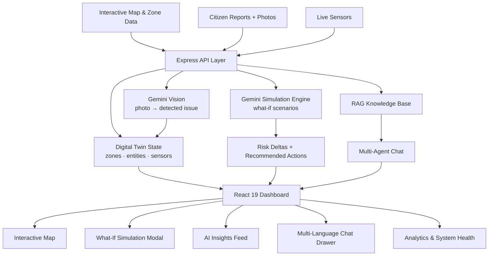

<div align="center">

# 🏙️ CivicTwin AI

### AI-Powered Urban Digital Twin, Risk Intelligence & What-If Simulation Platform

**A living map of the city — sensing risk, simulating consequences, and speaking every citizen's language.**

[](https://civic-twin-ai-wine.vercel.app/)
[](https://vercel.com)
[](https://react.dev)
[](https://www.typescriptlang.org)
[](https://ai.google.dev)
[](LICENSE)

<br/>

### 🔗 [**⚡ LAUNCH THE LIVE PLATFORM ⚡**](https://civic-twin-ai-wine.vercel.app/)

**`https://civic-twin-ai-wine.vercel.app/`**

<br/>

</div>

---

## 🌆 What Is This?

Cities generate risk in silence — a drain quietly loses capacity, an intersection quietly gets more congested, a ward quietly floods every monsoon for the same reason nobody wrote down. By the time it's obvious, it's an emergency.

**CivicTwin AI** builds a **live digital twin of a city** — zones, hospitals, drainage pumps, sensors, citizen reports — and layers an AI reasoning engine on top that can **explain why a zone is at risk, simulate what happens if conditions change, and answer a citizen's question in their own language.** It's part situational-awareness dashboard for planners and emergency response, part accessible early-warning system for the public.

```
City Sensors + Citizen Reports  ──▶  Digital Twin State (zones · entities · risk scores)
                                              │
                        ┌─────────────────────┼─────────────────────┐
                        ▼                     ▼                     ▼
              What-If Simulation      Multi-Agent AI Chat     Vision Analysis
              (rainfall, drainage,    (RAG-grounded,          (citizen photo →
               traffic, waste)         11 languages)           AI-detected issue)
                        │                     │                     │
                        └─────────────────────┴─────────────────────┘
                                              ▼
                              Risk-Ranked, Actionable City Intelligence
```

---

## ✨ Core Capabilities

### 🗺️ Live Interactive City Map
A Leaflet-powered map rendering administrative zones as risk-colored polygons, plus every critical entity — hospitals, fire and police stations, shelters, drainage pumps, water bodies, waste facilities, power substations, bridges, and live sensors — each carrying an operational status (`operational → strained → critical → maintenance → offline`).

### 📊 Zone Risk Intelligence
Every geo-zone carries a computed **0–100 risk score** across flood risk, traffic congestion, air quality (AQI), waste accumulation, waterlogging probability, and infrastructure stress — with contributing factors and historical event counts surfaced in a detail drawer.

### 🌊 What-If Simulation Engine
Move the dials — rainfall (+30%), drainage capacity (−10%), traffic surge (+20%), waste collection delta, temperature change — city-wide or for a single zone, and the AI projects:
- Baseline vs. simulated risk and the **risk delta**
- Infrastructure stress classification (`LOW → MODERATE → HIGH → CRITICAL`)
- **Estimated economic impact** in lakhs
- Zone-by-zone breakdown with projected waterlogging depth (cm) and traffic delay (minutes)
- A natural-language **AI explanation** of *why*
- **Recommended actions**, each with priority, cost estimate, and expected risk reduction

### 🧪 Scenario Comparison
Save and compare multiple simulated interventions side by side — cost tier, response-time impact, population protected, and a computed feasibility score — to help planners choose between competing mitigation strategies.

### 🤖 Multi-Agent AI Chat (RAG-Grounded)
A conversational assistant backed by a retrieval-augmented knowledge base, with visible **agent sourcing** and **tool-use transparency** — every response can show which specialized agent answered and which tools it invoked to get there, plus suggested follow-up prompts.

### 🌐 11-Language Accessibility
Full interface and AI-chat support across **English, Hindi, Tamil, Telugu, Kannada, Bengali, Marathi, Gujarati, Malayalam, Punjabi, and Odia** — because civic risk information only helps if everyone in the city can read it.

### 📸 Citizen Reporting with AI Vision
Citizens report floods, potholes, broken streetlights, waste, water leakage, traffic, pollution, and infrastructure issues — optionally with a photo. Gemini Vision analyzes the image to detect the issue, assign a confidence score, and flag the required action, feeding directly into the live twin.

### 📰 Real-Time AI Insights Feed
A continuously updating stream of AI-generated alerts — categorized by flood, traffic, infrastructure, sensor, or weather — each tagged with its source agent and severity (`info → warning → alert → critical`).

### 📈 Analytics & System Health
City-wide analytics dashboards alongside a live **system health panel** tracking each backend service's status, latency, and uptime — so operators can trust the data they're acting on.

### 📄 Exportable Reports
Generate shareable incident and risk reports directly from the platform for handoff to civic authorities or emergency response teams.

---

## 🏗️ Architecture



**Flow:** sensors and citizen reports feed the live twin → zone risk scores update → planners run what-if simulations against the twin → Gemini returns projected impact and ranked actions → insights and chat surface the reasoning in the user's own language → reports export for real-world response.

---

## 🧰 Tech Stack

| Layer | Technology |
|---|---|
| **Frontend** | React 19, TypeScript, Vite 8, Tailwind CSS 4 |
| **Mapping** | Leaflet + React-Leaflet |
| **UI / UX** | Lucide React icons, Motion (animations), Recharts |
| **Backend** | Node.js, Express 4, TypeScript (`tsx` / `esbuild`) |
| **AI** | Google Gemini via `@google/genai` — chat, vision, and simulation reasoning |
| **Localization** | 11-language translation layer (en, hi, ta, te, kn, bn, mr, gu, ml, pa, or) |
| **Deployment** | Vercel |

---

## 🚀 Getting Started

### Prerequisites
- **Node.js 18+**
- A **Google Gemini API key** — [get one here](https://aistudio.google.com/apikey)

### Installation

```bash
# 1. Clone the repository
git clone https://github.com/sathi2305/CivicTwin-AI.git
cd CivicTwin-AI

# 2. Install dependencies
npm install

# 3. Configure environment
cp .env.example .env
# add your Gemini key to .env

# 4. Start the dev server
npm run dev
```

The app runs at **http://localhost:3000**

### Environment Variables

```env
GEMINI_API_KEY="your_gemini_api_key"
APP_URL="http://localhost:3000"
```

> 🔐 `.env` is gitignored — never commit API keys. Rotate immediately if one is ever exposed.

### Available Scripts

| Command | Description |
|---|---|
| `npm run dev` | Dev server with Vite middleware + HMR |
| `npm run build` | Build client (Vite) and bundle server (esbuild) |
| `npm start` | Run the production build |
| `npm run preview` | Preview the built client |
| `npm run lint` | Type-check with `tsc --noEmit` |
| `npm run clean` | Remove build artifacts |

---

## 🔌 API Reference

**Base URL:** `https://civic-twin-ai-wine.vercel.app/api`

| Method | Endpoint | Description |
|---|---|---|
| `GET` | `/twin/zones` | All geo-zones with live risk scores and metrics |
| `GET` | `/twin/entities` | Hospitals, stations, shelters, pumps, sensors, and other twin entities |
| `GET` | `/twin/rag` | Query the RAG knowledge base directly |
| `POST` | `/twin/citizen-report` | Submit a citizen report (flood, pothole, waste, etc.) |
| `POST` | `/twin/vision-analyze` | Analyze a citizen-submitted photo with Gemini Vision |
| `POST` | `/twin/simulate` | Run a what-if scenario — returns risk deltas, impact, and recommended actions |
| `POST` | `/twin/chat` | Multi-agent, RAG-grounded conversational assistant |
| `POST` | `/twin/report` | Generate an exportable incident/risk report |
| `GET` | `/health` | Service status check |

---

## 🗂️ Project Structure

```
CivicTwin-AI/
├── server.ts                          # Express API, Gemini chat/vision/simulation
├── vite.config.ts                     # Vite + React + Tailwind config
├── index.html                         # App shell
├── .env.example                       # Environment template
└── src/
    ├── main.tsx                       # React entry point
    ├── App.tsx                        # Root state & layout
    ├── types/index.ts                 # Zones, entities, sensors, simulation types
    ├── data/
    │   ├── administrativeDistricts.ts # Zone & ward geometry data
    │   ├── mockCityData.ts            # Seed entities & sensors
    │   ├── ragKnowledge.ts            # RAG knowledge base source
    │   └── translations.ts            # 11-language string catalog
    └── components/
        ├── Navbar.tsx                 # Global navigation & language switch
        ├── InteractiveMap.tsx         # Leaflet city map
        ├── MetricStrip.tsx            # Top-line KPI strip
        ├── ZoneDetailsDrawer.tsx      # Per-zone risk breakdown
        ├── WhatIfSimulationModal.tsx  # Scenario parameter controls
        ├── ScenarioComparisonModal.tsx# Side-by-side scenario comparison
        ├── AIInsightsFeed.tsx         # Live AI alert stream
        ├── AIChatbotDrawer.tsx        # Multi-agent RAG chat
        ├── MultiAgentModal.tsx        # Agent sourcing & tool-use view
        ├── CitizenReportModal.tsx     # Report submission + photo upload
        ├── AnalyticsModal.tsx         # City-wide analytics
        ├── SystemHealthModal.tsx      # Backend service health
        └── ReportExportModal.tsx      # Exportable report generation
```

---

## ☁️ Deployment

Deployed on **Vercel**.

| Setting | Value |
|---|---|
| **Framework Preset** | Vite |
| **Build Command** | `npm run build` |
| **Output Directory** | `dist` |
| **Environment Variables** | `GEMINI_API_KEY` (set as a Vercel secret) |

**Live URL:** https://civic-twin-ai-wine.vercel.app/

---

## 🗺️ Roadmap

- [ ] Real sensor ingestion (IoT / municipal SCADA feeds) replacing mock telemetry
- [ ] Persistent database for zones, reports, and simulation history
- [ ] Push notifications for critical-risk zone transitions
- [ ] Public API for third-party civic-tech integration
- [ ] Historical trend analysis and seasonal risk forecasting
- [ ] Role-based dashboards for citizen / admin / emergency / planner / researcher roles
- [ ] Offline-first PWA for use during connectivity outages
- [ ] Expanded language coverage beyond the current 11

---

## 🤝 Contributing

```bash
git checkout -b feature/your-feature-name
git commit -m "Add: clear description of your change"
git push origin feature/your-feature-name
# Open a Pull Request
```

Run `npm run lint` before submitting. New translations should cover every existing string key in `src/data/translations.ts`.

---

## 📄 License

Distributed under the MIT License. See [`LICENSE`](LICENSE) for details.

---

## 👤 Author

**Sathiyamoorthi**

[](https://github.com/sathi2305)

---

<div align="center">

### ⭐ If this project sparks an idea, consider starring the repository.

**[🏙️ Try the Live Platform](https://civic-twin-ai-wine.vercel.app/)**

*A city that understands itself protects everyone in it.*

</div>
